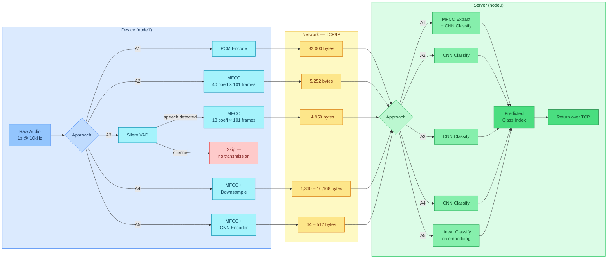
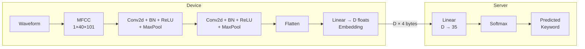
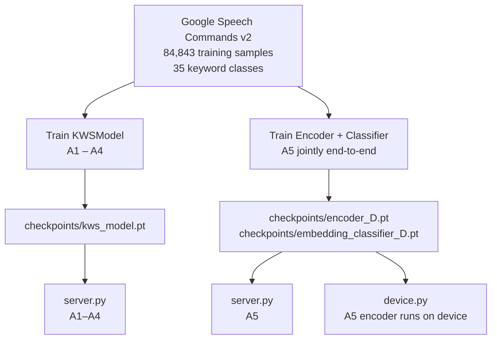

# System Architecture

## Overview

```mermaid
flowchart LR
    subgraph DEVICE["Device (node1)"]
        direction TB
        A[Raw Audio\n1s @ 16kHz] --> B{Approach}
        B -->|A1| C1[PCM Encode]
        B -->|A2| C2[MFCC\n40 coeff × 101 frames]
        B -->|A3| C3[Silero VAD]
        B -->|A4| C4[MFCC +\nDownsample]
        B -->|A5| C5[MFCC +\nCNN Encoder]
        C3 -->|speech detected| C3B[MFCC\n13 coeff × 101 frames]
        C3 -->|silence| SKIP[Skip —\nno transmission]
    end

    subgraph NET["Network — TCP/IP"]
        direction TB
        P1[32,000 bytes]
        P2[5,252 bytes]
        P3[~4,959 bytes]
        P4[1,360 – 16,168 bytes]
        P5[64 – 512 bytes]
    end

    subgraph SERVER["Server (node0)"]
        direction TB
        D{Approach}
        D -->|A1| E1[MFCC Extract\n+ CNN Classify]
        D -->|A2| E2[CNN Classify]
        D -->|A3| E3[CNN Classify]
        D -->|A4| E4[CNN Classify]
        D -->|A5| E5[Linear Classify\non embedding]
        E1 & E2 & E3 & E4 & E5 --> F[Predicted\nClass Index]
        F --> G[Return over TCP]
    end

    C1 --> P1 --> D
    C2 --> P2 --> D
    C3B --> P3 --> D
    C4 --> P4 --> D
    C5 --> P5 --> D

    style DEVICE fill:#dbeafe,stroke:#3b82f6,color:#1e3a5f
    style NET fill:#fef9c3,stroke:#eab308,color:#713f12
    style SERVER fill:#dcfce7,stroke:#22c55e,color:#14532d

    style A fill:#93c5fd,stroke:#2563eb,color:#1e3a5f
    style B fill:#bfdbfe,stroke:#3b82f6,color:#1e3a5f

    style C1 fill:#a5f3fc,stroke:#0891b2,color:#164e63
    style C2 fill:#a5f3fc,stroke:#0891b2,color:#164e63
    style C3 fill:#a5f3fc,stroke:#0891b2,color:#164e63
    style C3B fill:#a5f3fc,stroke:#0891b2,color:#164e63
    style C4 fill:#a5f3fc,stroke:#0891b2,color:#164e63
    style C5 fill:#a5f3fc,stroke:#0891b2,color:#164e63
    style SKIP fill:#fecaca,stroke:#ef4444,color:#7f1d1d

    style P1 fill:#fde68a,stroke:#d97706,color:#78350f
    style P2 fill:#fde68a,stroke:#d97706,color:#78350f
    style P3 fill:#fde68a,stroke:#d97706,color:#78350f
    style P4 fill:#fde68a,stroke:#d97706,color:#78350f
    style P5 fill:#fde68a,stroke:#d97706,color:#78350f

    style D fill:#bbf7d0,stroke:#16a34a,color:#14532d
    style E1 fill:#86efac,stroke:#16a34a,color:#14532d
    style E2 fill:#86efac,stroke:#16a34a,color:#14532d
    style E3 fill:#86efac,stroke:#16a34a,color:#14532d
    style E4 fill:#86efac,stroke:#16a34a,color:#14532d
    style E5 fill:#86efac,stroke:#16a34a,color:#14532d
    style F fill:#4ade80,stroke:#15803d,color:#14532d
    style G fill:#4ade80,stroke:#15803d,color:#14532d
```

---

## Per-Approach Data Flow

```mermaid
flowchart TD
    subgraph A1["A1 — Raw Waveform"]
        direction LR
        a1d[Device\nPCM bytes] --32KB--> a1s[Server\nMFCC + CNN]
    end

    subgraph A2["A2 — Fixed MFCC"]
        direction LR
        a2d[Device\nMFCC 40×101] --5.2KB--> a2s[Server\nCNN]
    end

    subgraph A3["A3 — Event-Triggered"]
        direction LR
        a3d[Device\nVAD → MFCC 13×101] --~5KB or 0--> a3s[Server\nCNN]
    end

    subgraph A4["A4 — Dynamic MFCC"]
        direction LR
        a4d[Device\nMFCC downsampled] --1–16KB--> a4s[Server\nCNN]
    end

    subgraph A5["A5 — Learned Embedding"]
        direction LR
        a5d[Device\nMFCC + CNN Encoder] --64–512B--> a5s[Server\nLinear Classifier]
    end
```

---

## A5 Model Architecture

```mermaid
flowchart LR
    subgraph DEVICE["Device"]
        W[Waveform] --> M[MFCC\n1×40×101]
        M --> C1[Conv2d + BN + ReLU\n+ MaxPool]
        C1 --> C2[Conv2d + BN + ReLU\n+ MaxPool]
        C2 --> FL[Flatten]
        FL --> EN[Linear → D floats\nEmbedding]
    end

    EN --D × 4 bytes--> CL

    subgraph SERVER["Server"]
        CL[Linear\nD → 35] --> SM[Softmax]
        SM --> PR[Predicted\nKeyword]
    end
```

---

## Training Pipeline

```mermaid
flowchart TD
    DS[Google Speech Commands v2\n84,843 training samples\n35 keyword classes]

    DS --> T1[Train KWSModel\nA1 – A4]
    DS --> T2[Train Encoder + Classifier\nA5 jointly end-to-end]

    T1 --> CK1[checkpoints/kws_model.pt]
    T2 --> CK2[checkpoints/encoder_D.pt\ncheckpoints/embedding_classifier_D.pt]

    CK1 --> S1[server.py\nA1–A4]
    CK2 --> S2[server.py\nA5]
    CK2 --> DEV[device.py\nA5 encoder runs on device]
```
